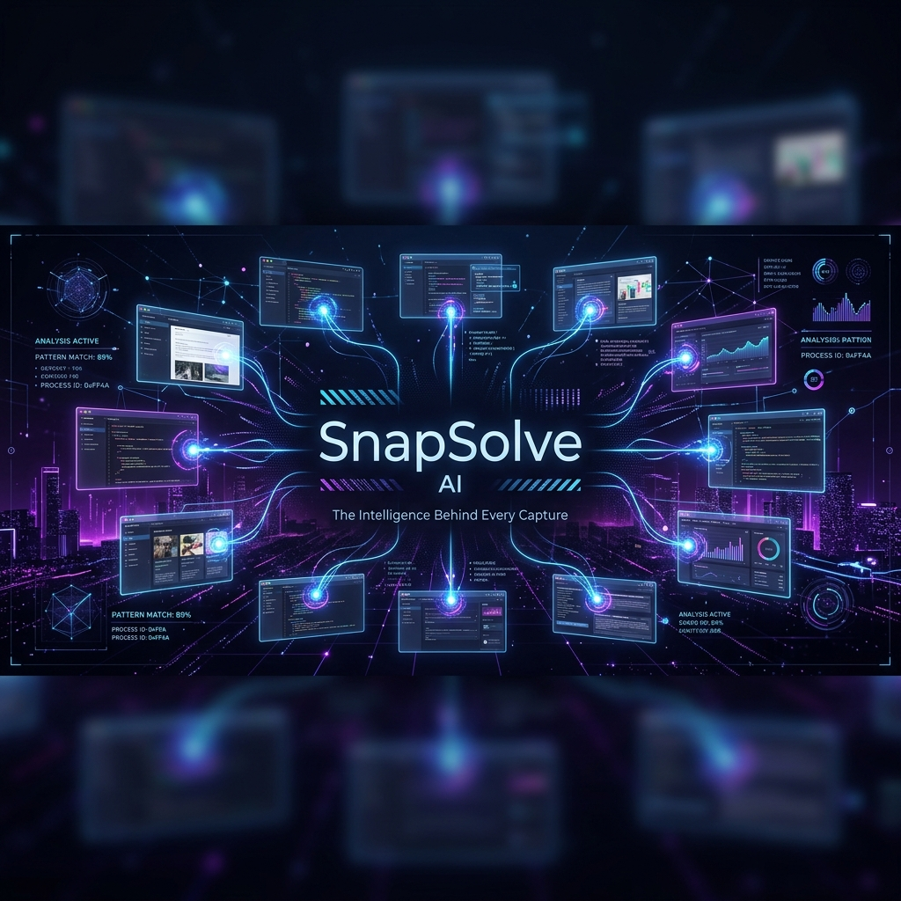

# SnapSolve AI - Intelligent Troubleshooting Recovery Engine



## 🚀 Overview
SnapSolve is a professional-grade AI recovery engine designed to transform generic troubleshooting into high-accuracy, domain-specific diagnostics. By leveraging a multi-AI consensus engine (Gemini, Groq, OpenRouter), SnapSolve analyzes screenshots to provide ranked root-cause hypotheses, actionable recovery blueprints, and critical safety warnings.

---

## ✨ Key Features
- **Multi-AI Consensus**: Parallel analysis from Gemini 1.5 Pro, Groq (Llama 3), and OpenRouter models.
- **Visual Intelligence**: Beyond OCR—understands UI patterns, app layout, and system state.
- **Recovery Blueprints**: Surgical, step-by-step instructions to fix issues.
- **Safety First**: "What Not To Do" warnings to prevent state corruption.
- **Enterprise Architecture**: Built with Flutter (Clean Architecture) and scalable backend.
- **Cross-Platform**: Seamless experience on Android and Web.

---

## 📱 Screenshots
| Analysis Flow | Expert Diagnosis | Recovery Blueprint |
| :---: | :---: | :---: |
|  |  |  |
*(Note: Upload your own screenshots to the `screenshots/` directory)*

---

## 🛠 Tech Stack
- **Frontend**: Flutter (Dart)
- **State Management**: Provider / Riverpod
- **AI Engine**: LangChain Dart / Custom Consensus Engine
- **Backend**: (Optional) Node.js / Python
- **CI/CD**: GitHub Actions
- **Infrastructure**: GitHub Pages / Vercel

---

## 🏗 Architecture
SnapSolve follows a strict **Clean Architecture** pattern:
- `lib/ai/`: Multi-model orchestration and consensus logic.
- `lib/services/`: Core API and hardware interface logic.
- `lib/providers/`: Business logic and state management.
- `lib/widgets/`: Premium, reusable UI components.
- `lib/models/`: Strongly typed domain entities.

---

## 🚦 Getting Started

### Prerequisites
- Flutter SDK (latest stable)
- Java 17+ (for Android builds)
- AI API Keys (Gemini, Groq, OpenRouter)

### Local Development Setup
1. **Clone the repository**:
   ```bash
   git clone https://github.com/yourusername/snapsolve-ai.git
   cd snapsolve-ai
   ```

2. **Setup Environment Variables**:
   Create a `config.json` file in the root directory:
   ```json
   {
     "GEMINI_API_KEY": "your_gemini_api_key",
     "API_BASE_URL": "https://api.snapsolve.ai/v1"
   }
   ```

3. **Install Dependencies**:
   ```bash
   flutter pub get
   ```

4. **Run the App**:
   ```bash
   # Running on Chrome
   flutter run -d chrome --dart-define-from-file=config.json

   # Running on Android
   flutter run -d android --dart-define-from-file=config.json
   ```

---

## 🚢 Deployment

### Android APK Build
Build a production-optimized, obfuscated APK:
```bash
flutter build apk --release --obfuscate --split-debug-info=build/app/outputs/symbols
```

### Web Deployment
SnapSolve is automatically deployed to GitHub Pages via GitHub Actions on every push to `main`.

---

## 🛡 Security & Privacy
- **Secret Management**: All API keys are injected at build time via `dart-define`.
- **Image Privacy**: Screenshots are processed in memory and never stored permanently.
- **Vulnerability Scanning**: Automated Dependabot and Secret Scanning enabled.

---

## 🤝 Contributing
Please read [CONTRIBUTING.md](CONTRIBUTING.md) for details on our code of conduct and the process for submitting pull requests.

---

## 📄 License
This project is licensed under the MIT License - see the [LICENSE](LICENSE) file for details.

---

## 📥 Download
Latest production builds are available in the [Releases](https://github.com/yourusername/snapsolve-ai/releases) section.
- [Download Android APK (v1.0.0)](https://github.com/yourusername/snapsolve-ai/releases/download/v1.0.0/app-release.apk)
- [Access Web Version](https://yourusername.github.io/snapsolve-ai/)
